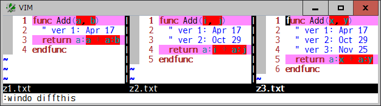

# difffilter

## Selectively compare lines as you want in diff mode

### Introduction

The standard "diff" command supports "--ignore-matching-lines=regexp (-I
regexp)" option to ignore hunks if all the inserted and deleted lines match
regexp. This plugin provides similar functionality but tries a line-level
filtering based on regexp and other matching criteria.

For example, vim will show such differences for these 3 files:


This plugin gets vim to exclude comment lines so that you can focus on
seeing the differences on the "return" statement.



As a default, this plugin highlights the diff excluded lines in `hl-Conceal`.
To hide those concealed lines, use the `conceallevel` and `concealcursor`
options. Additionally, like below, you can set the `t:DiffFilterConceal` or
`g:DiffFilterConceal` variable and show their filler lines with an eob(`~`)
character to align corresponding diff compared lines between windows. Disable
if not necessary,


Use `:diffupdate` command to reevaluate and redraw diff lines when text or
option is changed.

### Filter Expression

Internally, this plugin sets a function to the `diffexpr` option in order to:
* evaluate if each line should be diff compared or not
* mark the to-be-excluded lines in the buffer contents
* call a builtin diff function to compare them
* modify diff hunks to get vim to ignore the excluded lines

In above example, the following lambda expression is used to exclude comment
lines.
```
{lnum -> (&commentstring[:-2] == '%s') ?
  \getline(lnum) !~ '^\s*' . escape(&commentstring, '^$.*[]~\')[:-3] :
  \synIDtrans(synID(lnum, match(getline(lnum), '\S') + 1, 0)) !=
                                                    \hlID('Comment')}
```
That checks a comment string at the start of each line if the `&commentstring`
option indicates it possible. Otherwise, checks a comment syntax highlighting
on each line. That is a default expression in this plugin, which can be
commonly used for a comment line in a lot of filetypes.

You can specify another expression in the `t:DiffFilterExpr` tabpage local or
`g:DiffFilterExpr` global variable, like below.

To use the last selected Visual area:
```
let g:DiffFilterExpr = {lnum -> line("'<") <= lnum && lnum <= line("'>")}
```
To compare lines not including a multibyte character:
```
let g:DiffFilterExpr = {lnum -> getline(lnum) !~ '[^\x00-\x7F]'}
```
To filter unfolded lines:
```
  let g:DiffFilterExpr = {lnum -> foldlevel(lnum) == 0}
```
To select indented lines:
```
let g:DiffFilterExpr = {lnum -> 0 < indent(lnum)}
```
It is possible to specify a function which checks a comment block for a
filetype like C and C++:
```
let g:DiffFilterExpr = function('MyDiffFilterExpr')
function MyDiffFilterExpr(lnum)
  let [c_line, c_start, c_end] = ['//', '/*', '*/']
  let [c_line, c_start, c_end] = map([c_line, c_start, c_end],
                        \{_, v -> '^\s*' . escape(v, '/*')})
  for c in [c_line, c_start, c_end]
    if getline(a:lnum) =~ c | return 1 | endif
  endfor
  let pos = [line('.'), col('.')]
  call cursor([a:lnum, 1])
  let sline = searchpair(c_start, '', c_end, 'nW')
  call cursor(pos)
  return (0 < sline) ? 1 : 0
endfunction
```

### Options

* `t:DiffFilterExpr`, `g:DiffFilterExpr`
  * A boolean expression to evaluate if a line should be diff compared or not
    (default: see above)

* `t:DiffFilterConceal`, `g:DiffFilterConceal`
  * Highlight the diff excluded lines in `hl-Conceal` (1), plus show their
    filler lines (2), or disable them (0) (default: `1`)

* `g:DiffFilter`
  * Enable (1) or disable (0) this plugin (default: `1`).

### Requirements

This plugin requires a builtin diff function:
* `diff()` and patch-9.1.0099 in vim 9.1
* Lua `vim.diff()` in nvim 0.6.0

### See also

There are other diff related plugins available:
* [diffchar.vim](https://github.com/rickhowe/diffchar.vim): Highlight the exact differences, based on characters and words
* [spotdiff.vim](https://github.com/rickhowe/spotdiff.vim): A range and area selectable `:diffthis` to compare partially
* [wrapfiller](https://github.com/rickhowe/wrapfiller): Align each wrapped line virtually between windows
